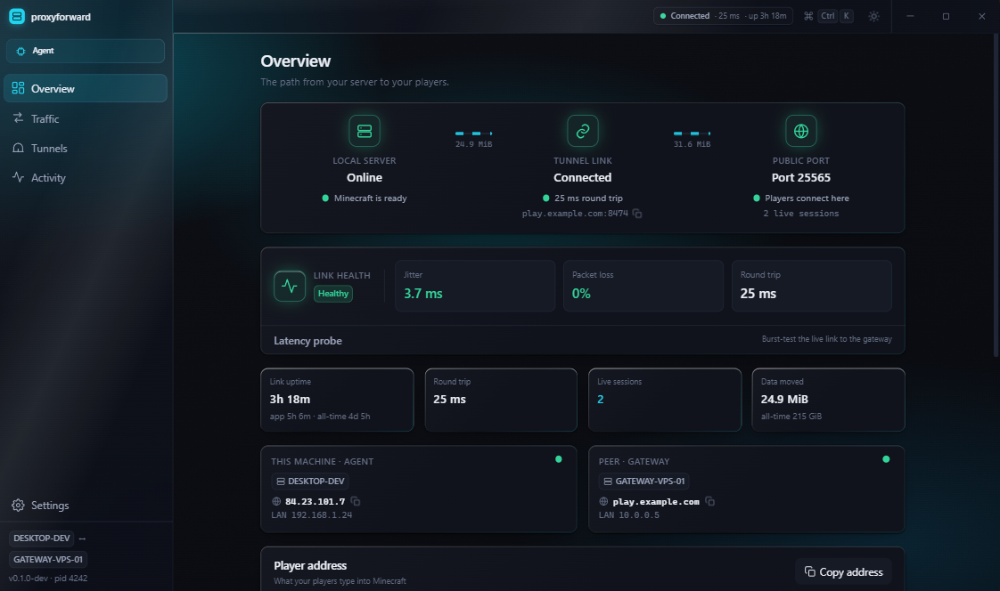
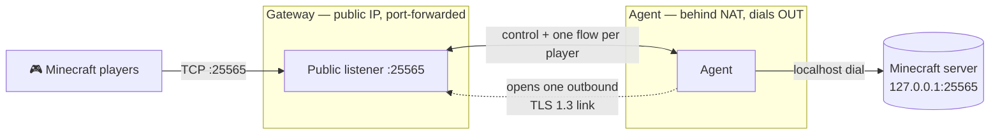
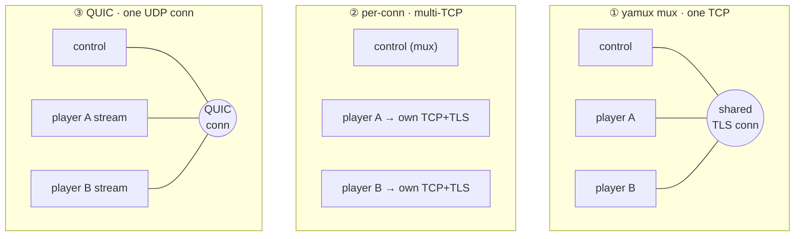
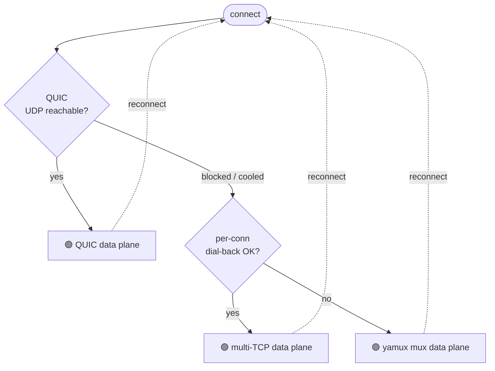
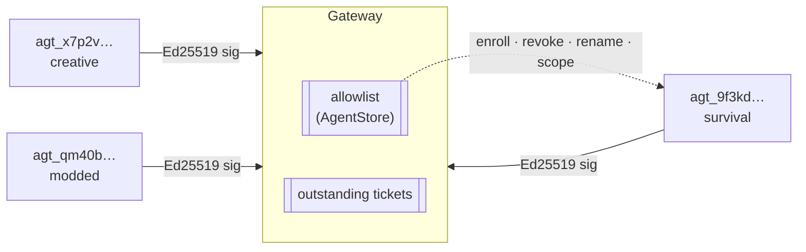

<div align="center">

# proxyforward

**Make your Minecraft server public — no port-forwarding on the Minecraft machine.**

An ngrok-style reverse tunnel: the machine hosting Minecraft dials *out* to a machine that
can accept inbound connections, and that machine relays player traffic back through the
one outbound link. One Windows binary is both halves.

[](https://github.com/xeri/proxyforward/actions/workflows/ci.yml)
[](https://github.com/xeri/proxyforward/actions/workflows/security.yml)
[](https://go.dev)
[](#)
[](https://wails.io)
[](#the-tunnel-in-one-link--three-data-planes)
[](#-security-model)
[](LICENSE)



</div>

---

## Contents

- [How it works](#how-it-works)
- [Download](#download) · [Quick start](#quick-start-two-machines)
- **Engineering**
  - [The tunnel in one link — three data planes](#the-tunnel-in-one-link--three-data-planes)
  - [Head-of-line blocking, and how each plane answers it](#head-of-line-blocking-and-how-each-plane-answers-it)
  - [Auto: pick the best plane the network allows](#auto-pick-the-best-plane-the-network-allows)
  - [One gateway, many agents — identity & enrollment](#one-gateway-many-agents--identity--enrollment)
  - [Gateway-authoritative config](#gateway-authoritative-config)
  - [Built to stay up — self-healing links](#-built-to-stay-up--self-healing-links)
  - [Engineered for the hot path](#-engineered-for-the-hot-path)
  - [Security model](#-security-model)
- [Life of a player byte](#life-of-a-player-byte)
- [Features](#features) · [Observability](#-observability--windows-citizenship) · [CLI](#cli)
- [Building & developing](#building) · [Contributing](#contributing) · [License](#license)

## How it works

The **agent** sits next to Minecraft and can't accept inbound connections (it's behind
NAT). The **gateway** sits somewhere with a reachable public IP. The agent makes a single
outbound TLS 1.3 connection to the gateway and keeps it open; the gateway binds a public
port, accepts players, and relays each one back down that link. Players connect to the
gateway as if it *were* the server.



One `proxyforward.exe` runs in **either role** — as a WebView2 desktop app (Wails + React
19), a `--headless` console process, or a Windows service. Nothing on the Minecraft
machine's router changes; only the gateway forwards a port.

## Download

Grab the installer or the portable exe from the
[latest release](https://github.com/xeri/proxyforward/releases/latest). Windows 10/11 x64;
you need it on **both** machines. There is no Linux or macOS build — the engine is
Windows-only (named pipes, service, firewall integration).

The binaries are **not code-signed**, so SmartScreen will warn on first run
("unknown publisher"). Rather than asking you to trust that, every release is built by
[this workflow](.github/workflows/release.yml) and carries a provenance attestation you
can verify:

```
gh attestation verify proxyforward-<version>-windows-amd64.exe -R xeri/proxyforward
```

`SHA256SUMS.txt` and an SPDX SBOM ship with each release.

## Quick start (two machines)

**On the public machine — the gateway:**

1. **Launch** `proxyforward.exe` and choose **"This faces the internet."**
2. **Enter** your public hostname (a stable DNS/DDNS name is strongly recommended — see
   [DNS and dynamic IPs](#dns-and-dynamic-ips)) and click **Start gateway**.
3. **Copy** the pairing code it shows:
   `pxf://host:8474/v1/pair/<token>#sha256:<fingerprint>`
4. **Forward** port **25565** (or your chosen public port) on the router to this machine,
   and allow the inbound firewall rule when prompted
   (Settings → Windows integration → *Add rule*).

**On the Minecraft machine — the agent:**

1. **Launch** `proxyforward.exe` and choose **"This hosts Minecraft."**
   (Or just **click the `pxf://` pairing link** — Windows hands it to the app, which opens
   straight into pairing.)
2. **Paste** the pairing code. It validates instantly (`✓ certificate pinned`).
3. **Confirm** the local address (`127.0.0.1:25565`) and public port, then click **Connect**.

The agent's dashboard turns green and players join at `your-host:25565`. Use
**Dashboard → Test public reachability** to validate the whole path
(DNS → firewall → router → tunnel → server) in one click.

---

## The tunnel in one link — three data planes

Everything above is programmed against a single `transport.Session` interface, so *how*
the player flows ride the wire is a pluggable choice. proxyforward ships **three** data
planes and picks between them automatically. All three share the same TLS-pinned control
plane, the same admission and rate-limiting, and byte-identical hello frames — they differ
only in how a player's bytes travel.



| Plane | Wire | Isolation | Cost | Config value |
|---|---|---|---|---|
| **mux** | one TCP+TLS, [yamux](https://github.com/hashicorp/yamux)-multiplexed: control stream + one stream per player | ⚠️ shared TCP — a lost segment stalls *all* streams (transport-level HoL) | 1 conn, 1 handshake, 1 NAT entry | `transport = "mux"` |
| **per-conn** | control on the mux; **each player dials back a fresh TCP+TLS connection** | ✅ full — a lost segment on one player's socket can't touch another's | N+1 conns / handshakes / NAT entries | `transport = "per-conn"` |
| **QUIC** | one UDP [QUIC](https://github.com/quic-go/quic-go) connection; control + every player are independent QUIC streams | ✅ full — QUIC does per-stream loss recovery over one connection | 1 conn, 1 handshake, 1 NAT entry | `transport = "quic"` |

QUIC gets you per-conn's isolation *and* mux's single-connection economy: one handshake,
one NAT mapping, and if the agent's IP changes mid-session, QUIC connection migration
follows it without a reconnect. It binds a UDP listener on the **same port number** as the
TCP control listener (the TCP and UDP port spaces are independent, so one `host:port` in
the pairing code serves both), reuses every pre-auth guard and the same admission path, and
adds no new control message or capability — it's a parallel wire, negotiated by which
socket the agent dials.

## Head-of-line blocking, and how each plane answers it

Head-of-line (HoL) blocking is the reason there's more than one plane. When many players
share **one TCP connection** (the mux plane), TCP guarantees in-order delivery of the
*whole byte stream*. A single lost packet forces the kernel to hold back every later
byte — for **every** player — until that one packet is retransmitted. Player B's chunk
burst waits on Player A's dropped segment. On a clean LAN this never shows; on a lossy WAN
it's the difference between "one player rubber-banding" and "everyone rubber-banding."

- **per-conn** eliminates it structurally: each player owns a separate TCP connection, so
  loss is contained to that connection's own kernel buffers.
- **QUIC** eliminates it at the protocol level: streams are independently flow-controlled
  and loss-recovered inside one connection, so a drop on one stream never blocks another.

This isn't a claim — it's a **CI gate**. `TestBurstThroughputAndCrossStreamLatency` (with
per-transport twins `TestBurstThroughputPerConn` and `TestBurstThroughputQUIC`) pushes a
**64 MiB** burst down one flow through the full agent → gateway → client path and fails if
throughput drops below **20 MiB/s** *or* a concurrent second flow's round-trip exceeds
**500 ms** mid-burst. A regression that reintroduces cross-flow HoL blocking turns the
build red ([`e2e_test.go`](internal/e2e/e2e_test.go)).

## Auto: pick the best plane the network allows

The shipped default is `transport = "auto"` — a connect-time fallback ladder,
best-isolation-first. The agent tries each rung; a rung that *connects* is used, a rung
that fails to connect falls through immediately to the next.



The clever part is *cooling*: a rung is only marked "don't retry for a while" once a
**lower** rung succeeds — that's the unambiguous "UDP is blocked here" signal (QUIC
failed, but per-conn worked). If *every* rung fails, the link is simply down and nothing is
cooled, so a transient outage doesn't permanently demote you off QUIC. The cooldown clears
the instant the OS reports a network change, and whichever rung wins is surfaced to the GUI
(`Status.Transport`) so you can see what auto settled on.

## One gateway, many agents — identity & enrollment

A single gateway fronts a **fleet** of agents. They're told apart not by a shared secret
but by a per-agent **cryptographic identity**: on first run each agent generates a
long-term **Ed25519** keypair (PKCS#8, mode `0600`, never leaves the machine). Its public
ID — `agt_<base32 fingerprint of the public key>` — is *derived*, so it's stable across
re-pairs and can't be forged by someone who merely holds a token.

Two ways an agent authenticates, told apart by the shape of the token in the pairing code:

- **Enrollment ticket** (`tkt_…`, the modern path): a **single-use** nonce the gateway
  mints and embeds in the pairing code. The agent replays it once; the gateway binds that
  agent's public key into its **allowlist** under the derived `agt_` ID and the ticket is
  spent. Every later connection is authenticated by an Ed25519 signature over a message
  **bound to the gateway's pinned cert fingerprint** — so a signature made for one gateway
  can't be replayed against another.
- **Shared token** (bare hex, legacy): one token admits many agents; a matching `agentID`
  *supersedes* (reconnect), a distinct one is admitted *alongside*. Simpler, but with no
  per-agent revocation.



Enrolled identities unlock the operations a shared token can't safely offer:

- **Scope** — restrict which public ports and tunnel IDs an agent may bind (empty = any,
  the permissive default). An agent can't squat a port outside its lane.
- **Revoke** — an identity is marked revoked (kept, not deleted) so its next connect gets a
  clear *"revoked"* answer instead of a confusing *"unknown identity."*
- **Clone detection** — because a derived, pubkey-bound ID makes two-places-at-once
  *impossible* unless the private key was copied, the same `agentID` rapidly contested from
  two IPs raises a `clone-suspected` event and a GUI card nudging you to re-enroll.
- **Auto port-reassign** — if a requested public port is already taken, the gateway keeps
  the agent online and binds a free, policy-valid alternative, recording a `port-reassigned`
  event with a one-click "reclaim it" card, rather than failing the tunnel.

> **Residual risk that ships honestly:** with a *shared* token the model is
> token + self-asserted ID + first-come-first-served ports and no per-agent revocation — a
> token-holder can supersede or port-squat, recoverable only by rotating the shared token.
> Enrollment tickets + per-identity revocation are the mitigation; prefer them.

## Gateway-authoritative config

Enrolled agents negotiate the `gateway-config` capability and the **gateway becomes the
source of truth** for that identity's tunnel set. It stores each identity's desired
configuration with a monotonic generation, hashed by `HashTunnels`. On connect the agent
reports its `configHash`/`configGeneration` in the hello; on any drift the gateway pushes
`push_config{generation, hash, tunnels[]}` and the agent applies it and acks.

A local edit isn't last-write-wins guesswork — it's a `propose_config` the gateway
**adopts, bumps the generation, and re-pushes** to that agent; a proposal made against a
stale generation is refused and the authoritative set re-pushed. Deterministic, and
recoverable from either end. Shared-token agents (which can't carry a stable identity) have
the capability negotiated away and fall back to the simpler `tunnel-sync` desired-state
reconcile.

## 🔁 Built to stay up — self-healing links

The link is designed to survive the messiness of home networks — sleep, Wi‑Fi roams, DHCP
lease changes, gateway restarts — without a human noticing.

- **Full-jitter exponential backoff** — 1 s → 60 s cap, sequence resets after 60 s of
  stable connection. Full jitter means a gateway restart doesn't trigger a
  thundering-herd of reconnects across a fleet.
- **Instant reconnect on network change** — Windows `NotifyAddrChange` and a
  wall-clock-jump resume-from-sleep detector short-circuit the backoff instead of
  waiting out a read deadline. DNS re-resolves on **every** attempt, so dynamic IPs and
  DDNS just work; the gateway address is even editable later without re-pairing.
- **Identity, not just auth** — a reconnect by the same ID supersedes the old session
  (anti-flap dampened, so an ID collision degrades to a slow contest, not a loop); a
  *different* agent gets a clear rejection instead of the two fighting forever.
- **QUIC connection migration** — on the QUIC plane, an agent whose IP changes is followed
  passively without tearing down the session at all.
- **Fatal errors stop, they don't hammer** — `bad_token`, `agent_conflict`, and version
  mismatches are classified fatal: the agent stops and surfaces the reason in the UI,
  rather than retry-hammering the gateway.
- **Ghost-listener guarantee** — all session/listener lifecycle runs on the gateway's
  single actor goroutine; evicting one agent closes *its* listeners and drains *its*
  connections while every other agent's stay untouched, and a rebound port is provably free
  before handoff. Regression-guarded by `TestAgentRestartRebinds` and
  `TestEvictionIsolatesAndDrains`.

## ⚡ Engineered for the hot path

The relay is a purpose-built splice, not an `io.Copy` wrapper — every default was
questioned and most were replaced:

| | Optimization | Why it matters |
|---|---|---|
| 📦 | **128 KiB pooled buffers** (`sync.Pool`) | `io.Copy`'s 32 KiB default throttles chunk-load bursts on fat pipes — [`relay.go`](internal/relay/relay.go) |
| 🪟 | **1 MiB yamux stream windows** (4× default) | a full Minecraft chunk burst fits in flight on one stream without stalling — [`yamux.go`](internal/transport/yamux.go) |
| 🪟 | **6 MiB QUIC stream / 12 MiB conn receive windows** | the same burst-headroom on the QUIC plane, per stream — [`quicconfig.go`](internal/transport/quicconfig.go) |
| 💓 | **One liveness owner** | yamux/QUIC transport keepalive is *off*; the app-level 5 s ping (which also feeds the dashboard RTT) is the single source of truth, backed by a 15 s idle read deadline |
| ⏱️ | **`TCP_NODELAY` end-to-end** | no Nagle-induced latency on either leg, and player data never enters the control path |
| 🤝 | **FIN-preserving half-close** | EOF on one leg becomes `CloseWrite` on the other while the opposite direction keeps draining — a kick/disconnect message written just before close arrives intact instead of becoming a raw reset |
| 🛡️ | **2-minute write-stall deadline** | a peer that stops draining can never park a splice goroutine forever; byte counters are atomic, snapshotted lock-free by the GUI and metrics |
| 🎭 | **Single-goroutine gateway actor** | all session/listener lifecycle mutations are naturally serialized — a re-registered port can never race its own dying listener — [`actor.go`](internal/gateway/actor.go) |

There is **no per-byte or per-packet logging or locking anywhere on the data path**, and
the Go→JS boundary is coalesced into one `tick` event so the UI never touches the splice.

## 🔒 Security model

- **TLS 1.3 only, both directions.** The gateway generates a self-signed **ECDSA P-256**
  certificate on first run; the pairing code pins its **SHA-256 fingerprint** — no CA, no
  third party, nothing to leak. The key exchange is Go's post-quantum hybrid
  **X25519MLKEM768**.
- **Per-agent Ed25519 identity** (above): connections are signed proof-of-possession bound
  to the gateway's cert fingerprint, not a bearer secret that can be replayed elsewhere.
- **Constant-time comparisons** for the auth token and the certificate fingerprint
  (`crypto/subtle`).
- **Pre-auth hardening** — the entire unauthenticated prologue (accept → TLS handshake →
  hello frame) must finish within **10 s**, and pre-auth frames are capped at **4 KiB**
  (vs 64 KiB post-auth), with the length checked *before* allocation — internet scanners
  get nothing to chew on.
- **fail2ban-style auth limiter** — 10 failed attempts per minute per IP; successes never
  count, so a legitimately flapping agent is never locked out while a brute-forcer is.
- **Connection gates** — 4096 global / 32 per-IP, plus a public-port allowlist.
- **Locked-down IPC** — the GUI attaches to the engine over a named pipe whose ACL admits
  only Administrators, SYSTEM, and the interactive user.
- **Redacted diagnostics** — bundles strip every secret, host, IP, and identity; peer IPs
  become stable `sha256` pseudonyms, leak-tested in CI.

## Life of a player byte

```mermaid
sequenceDiagram
    autonumber
    participant Pl as Player
    participant GW as Gateway
    participant Ag as Agent
    participant MC as Minecraft

    Pl->>GW: TCP connect :25565
    Note over GW: connGate.admit (global + per-IP)
    alt mux / QUIC
        GW->>Ag: open a stream over the shared conn
    else per-conn
        GW->>Ag: open_data{connId} on control
        Ag-->>GW: dials back a fresh TCP+TLS data conn
        Note over GW: matches connId → exactly-once handoff
    end
    GW-->>Ag: open_conn{tunnelId, clientAddr, connId} header
    Ag->>MC: dial 127.0.0.1:25565 (optional PROXY v2 header)
    loop steady state
        Pl->>MC: bytes spliced both ways · 128 KiB pooled buffers
        GW-->>Ag: ping/pong · conn_stats (per-player kernel RTT)
    end
    Note over Pl,MC: EOF → CloseWrite (FIN); opposite leg drains
```

Counters are per-connection atomics, sampled at 10 Hz into RRD tiers and shipped to the GUI
via a 2 Hz lock-free snapshot — the splice itself never blocks on measurement.

## Features

Per-tunnel options (**Tunnels → edit**, off by default):

| Feature | What it does |
|---|---|
| **Minecraft-aware** | sniffs the login handshake for usernames (Connections view) and probes the local server's liveness |
| **PROXY protocol v2** | prepends a PP2 header when dialing the local server so Paper/Velocity see the real player IP (set `proxy-protocol: true` in `paper-global.yml`). ⚠️ **Mutually exclusive** with BungeeCord/Velocity IP-forwarding on the same server |
| **Offline MOTD** | a message the gateway serves when the agent or server is down, instead of a dead port. Leave blank for a clean disconnect |
| **Bandwidth cap** | per-tunnel throughput limit (combined / per-direction / per-connection scope) enforced on the splice on both sides, to protect the gateway uplink |

Global toggles live in **Settings**: transport mode (`auto`/`quic`/`per-conn`/`mux`),
Prometheus `/metrics`, abuse limits, logging.

### DNS and dynamic IPs

<details>
<summary>Why a stable hostname matters (and what to do on a dynamic IP)</summary>

<br>

Minecraft's JVM caches DNS aggressively. If the gateway's public IP changes,
already-connected clients keep dialing the stale IP until they restart — nothing
server-side can fix that. So:

- Give players a **stable, low-TTL hostname** (ideally a `_minecraft._tcp` SRV record so
  you can also hide the port).
- On a dynamic residential IP, use DDNS and put that hostname in the gateway's public
  address — pairing codes and reconnect logic re-resolve it every time.

</details>

## 📊 Observability & Windows citizenship

- **RRD-style traffic history** — five resolution tiers from **100 ms** buckets (live
  graph) up to **1-day** buckets (~3 years retention), with rate OHLC candles per bucket.
  Persistent tiers are saved atomically, so a crash never corrupts history.
- **Local-only analytics** — sessions, players, geography (GeoLite2), and uptime in a
  SQLite DB next to the config. The only outbound calls are Mojang identity/skins
  (opt-out). No telemetry ever leaves the machine.
- **Logging that respects your disk** — 10 MiB × 3 rotating files plus an in-memory ring
  the GUI reads live.
- **One UAC prompt, ever** — the firewall rule is added via `netsh advfirewall`, scoped
  to the program (not a port), with one-click status/repair in the GUI.
- **Diagnostics with names attached** — a port conflict reports
  *"Port 25565 is in use by java.exe (PID 1234)"* via `GetExtendedTcpTable`, not a bare
  `bind: address already in use`.

## CLI

```
proxyforward                      # GUI (attaches to a running service, else runs the engine)
proxyforward gateway --headless   # run the gateway in the console
proxyforward agent   --headless   # run the agent in the console
proxyforward pair <code>          # configure this machine as an agent from a pairing code
proxyforward firewall <status|add|remove>
proxyforward service <install|uninstall|start|stop> --role gateway
```

When installed as a Windows service the engine runs headless (config in
`%ProgramData%\proxyforward`) and the GUI attaches to it over the named pipe as a thin
client — exactly one process ever owns the ports.

## Building

```
wails build              # produces the single Windows/amd64 proxyforward.exe
```

A fresh clone must build the frontend once before any Go command
(`cd frontend && npm ci && npm run build`) — `main.go` embeds `frontend/dist`.

## Development

```
cd frontend && npm install
wails dev                # full app with hot-reload frontend

# UI-only iteration in a plain browser (mocked Go bridge):
cd frontend && npm run dev
#   http://localhost:5173/?mock=agent      (or ?mock=gateway / ?mock=wizard)
```

## Testing

```
go test ./...
```

9 fuzz targets on the internet-facing parsers (control frames, Minecraft
handshake/VarInt/packet, login sniffer, offline responder, pairing code, sniff tap) plus an in-process
loopback e2e suite that is goroutine-leak-checked with `goleak` and enforces the
throughput/latency floor and per-transport twins described [above](#head-of-line-blocking-and-how-each-plane-answers-it).

`go test` runs the fuzz **seed corpora**; the targets are actually fuzzed nightly
([`fuzz.yml`](.github/workflows/fuzz.yml)). Every push also runs the race detector, the
burst floor, CodeQL, and `govulncheck` — see [`ci.yml`](.github/workflows/ci.yml) and
[`security.yml`](.github/workflows/security.yml).

## Contributing

Contributions are welcome — bug reports, transport experiments, UI polish, and docs alike.

**Before you start**

- Read [`CLAUDE.md`](CLAUDE.md) (the operating manual) and, for the subsystem you're
  touching, its deep-dive in [`docs/agent/`](docs/agent/). The **Invariants** in
  `CLAUDE.md` survive any rewrite — protect them.
- Anything touching the **wire protocol** (`internal/control`), the **hot path**
  (`internal/relay`, `internal/transport`), or a **release** is an escalation trigger —
  open an issue to discuss the design before writing code.

**The gates your PR must clear** (all enforced in CI, none negotiable):

| Gate | What it checks |
|---|---|
| `go test ./...` | unit + loopback e2e + goleak + doc-citation checks |
| **Burst floor** | ≥ 20 MiB/s throughput and ≤ 500 ms cross-flow RTT on a 64 MiB burst — **never lower the floor to go green** |
| `-race` | the race detector (CI is the only place it runs — it needs cgo) |
| `gofmt` · `go vet` · `golangci-lint` | formatting and static analysis; a PostToolUse hook also checks gofmt per-edit |
| `npm run build` | `tsc` + `vite` — the only frontend checker |
| Doc-citation test | every file/symbol/test name cited in docs must exist (`internal/doccheck`) |
| Security | CodeQL, `govulncheck`, gitleaks, dependency-review, `npm audit` |

**House style**

- **Commits**: lowercase, terse, scope-prefixed (`gateway: …`); one concern per commit;
  **protocol and implementation never change in the same commit**.
- **Go**: package docs state the ownership/concurrency model up top; comments explain
  *why* and justify every tuned number (they're the spec). Zero `TODO`/`FIXME` markers —
  debt goes in [`docs/agent/polish-backlog.md`](docs/agent/polish-backlog.md).
- **Numbers** live in exactly one place: the "The numbers" table in
  [`docs/agent/architecture.md`](docs/agent/architecture.md). Cite constants by name;
  don't restate values.
- **UI**: read [`frontend/DESIGN.md`](frontend/DESIGN.md) first. Every data surface needs
  all four states — skeleton, real data, empty, and an *honest* unavailable state.
- **Honesty over hype**: don't document or build on features that don't exist end-to-end.
  The "Reality check" table in `CLAUDE.md` is the ground truth; when you implement a stub,
  delete its row in the same commit.

New to the code? The `.claude/skills/` playbooks (`hot-path`, `wire-protocol`,
`ui-change`, `backend-capability`, …) walk through each kind of change step by step.

## License

[GPL-3.0](LICENSE)
</content>
</invoke>
